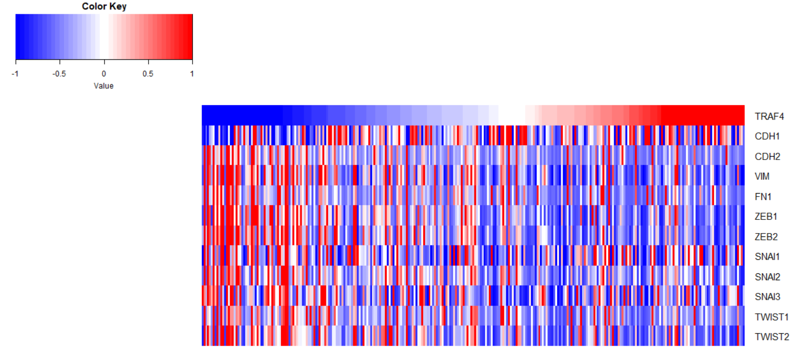
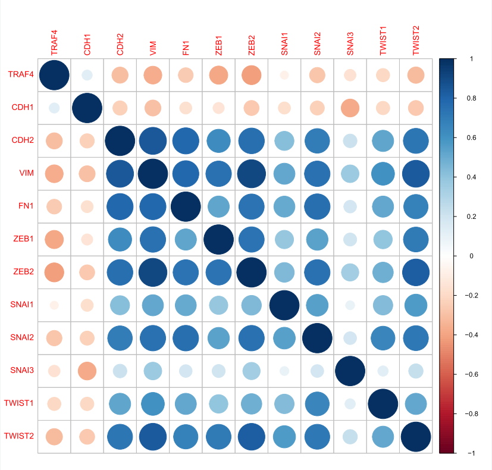

## TCGA分析
>对BRCA、GBM、LGG也一样，只是文件前缀不同
- 输入：
  `COAD.merged_only_clinical_clin_format.txt`：COAD原始临床数据
  `COAD.rnaseqv2__illuminahiseq_rnaseqv2__unc_edu__Level_3__RSEM_genes_normalized__data.data.txt`：COAD原始RNAseq数据
- 脚本：
  `COAD_TRAF4nEMT.R`
- 输出：
  `COAD_RNAseq_TRAF4nEMT_zscore.csv`：287个COAD样本的TRAF4和EMT相关基因的表达矩阵，zscore标准化
  `COAD_clinical.csv`：COAD临床数据
  `COAD_RNAseq_TRAF4nEMT_zscore.csv`：COAD TRAF4和EMT的RNAseq zscore
  `TRAF4_EMT_zscore_heatmap.pdf`：287个COAD样本的TRAF4和EMT相关基因的表达热图，zscore标准化
  `TRAF4_EMT_zscore_cor.pdf`：287个COAD样本的TRAF4和EMT相关基因的表达相关矩阵，zscore标准化
### 数据获取
- RNAseq以及临床数据：[https://gdac.broadinstitute.org/](https://gdac.broadinstitute.org/)
### 数据处理
- RNAseq数据
  1. 筛选：去掉超过一半样本中不表达（初始值为0）的基因
  2. zscore标准化：参考[https://blog.csdn.net/Orange_Spotty_Cat/article/details/80312154](https://blog.csdn.net/Orange_Spotty_Cat/article/details/80312154)
  3. 压缩区间：将zscore压缩到[-4,4]内，小于-4的取-4，大于4的取4
### 可视化
- 基因表达热图
    
- 基因表达相关矩阵
    
### 参考资料
1. 数据获取和预处理：
   [https://github.com/mforde84/RNAseq-Survival-Analysis-TCGA-KIRC](https://github.com/mforde84/RNAseq-Survival-Analysis-TCGA-KIRC)
   [https://www.biostars.org/p/153013/](https://www.biostars.org/p/153013/)
2. 热图：[https://uteric.github.io/TCGA/TCGA7Heatmap/](https://uteric.github.io/TCGA/TCGA7Heatmap/)
3. 相关图：[【【0基础R语言】29.史上最全R语言相关性热图绘制（GEO、TCGA基因相关性分析corrplot），500行代码绘制各种相关性图【生信A计划】-哔哩哔哩】](https://b23.tv/WsWASqQ)